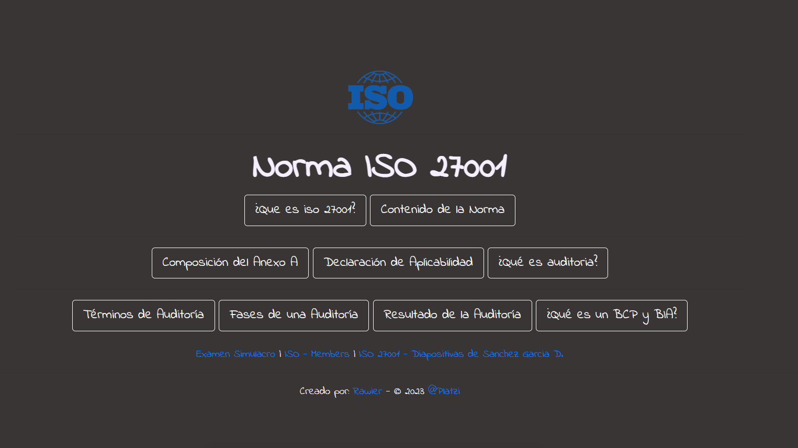

## Norma ISO 27001

- Simple page where the content of the 27001 standard is summarized in Spanish.

# Go to the page
- [ISO 27001]([./github/FUNDING.yml](https://rawierdt.github.io/iso-27001/))

or

- [Rawier's Portfolio](https://rawier.vercel.app/portfolio)

# Download
`git clone git@github.com:Rawierdt/iso-27001.git`

[Check the latest release](https://github.com/Rawierdt/iso-27001)

# License
💜 [MIT License](/LICENSE)